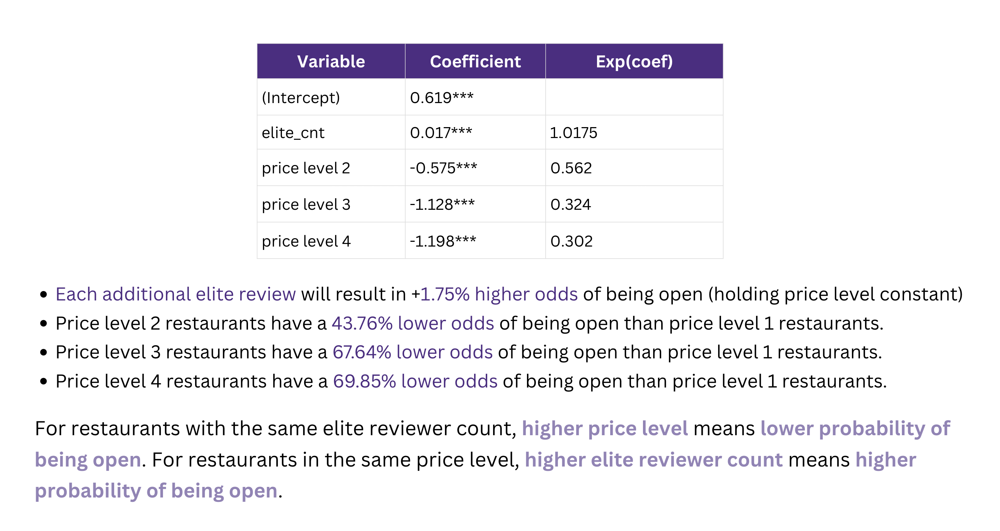
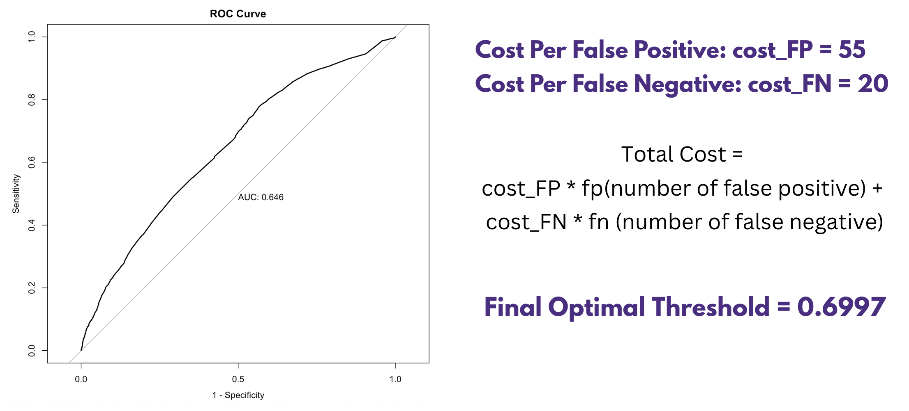
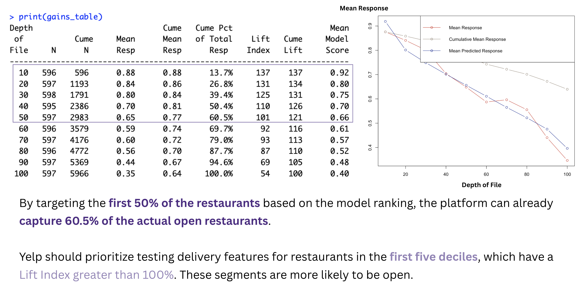
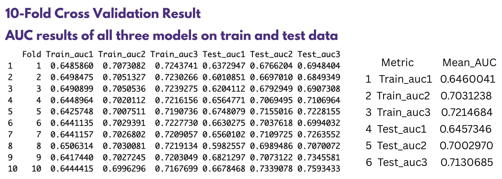

# Yelp-Restaurants
Found the features that can predict restaurant’s open status on Yelp using Logistic Regression.

***Background***

Yelp's delivery service feature needs a model to accurately determine whether a restaurant is currently in business (open/permanently closed) based on its reviews.

Predicting a restaurant is open when it’s closed (False Positive) will lead to failed delivery attempts and users' dissatisfaction. Predicting a restaurant is closed when it’s open (False Negatives) results in missed revenue opportunities.

## STEP 1: Logistic Regression Model and Thresholding

```math 
\log\left(\frac{P(\text{open} = 1)}{1 - P(\text{open} = 1)}\right) = \beta_0 + \beta_1 \cdot \text{elitecnt} + \beta_2 \cdot \text{pricelevel}_2 + \beta_3 \cdot \text{pricelevel}_3 + \beta_4 \cdot \text{pricelevel}_4 + u_i 

```

- open: whether the restaurant's status is "open" on Yelp.
- elitecnt: number of elite reviewers in the comment section
- pricelevel: the restaurant's price level on Yelp
  


After finding out the equation, the platform needs to ***set a threshold*** to correctly filter out the closed restaurants. The goal is to maximize revenue and minimize cost.



All restaurants with an open probability lower than 0.6997 will be filtered out. The optimal threshold reduces expensive delivery failures and captures revenue opportunities.

#### From a business perspective, Yelp wants to identify open restaurants as quickly and efficiently as possible. 

***A gains table is used*** to evaluate how well the predictive model ranks restaurants by their likelihood of being open, helping the company prioritize outreach or visibility efforts based on those with the highest predicted probability.



## STEP 2: Model Evaluation
The Yelp company is curious whether star level and location will affect the probability of opening. The other two logit regression models are introduced to predict the open status of restaurants.

K-fold Cross-Validation is used to evaluate the three models.

***Model 1***
```math 
\log\left(\frac{P(\text{open} = 1)}{1 - P(\text{open} = 1)}\right) = \beta_0 + \beta_1 \cdot \text{elitecnt} + \beta_2 \cdot \text{pricelevel}_2 + \beta_3 \cdot \text{pricelevel}_3 + \beta_4 \cdot \text{pricelevel}_4 + u_i 

```

***Model 2***
```math 
\log\left(\frac{P(\text{open} = 1)}{1 - P(\text{open} = 1)}\right) = \beta_0 + \beta_1 \cdot \text{elitecnt} + \beta_2 \cdot \text{pricelevel}\cdot \text{starlavel} + \beta_J \cdot \text{repeated cnt} + u_i 

```

***Model 3***
```math 
\log\left(\frac{P(\text{open} = 1)}{1 - P(\text{open} = 1)}\right) = \beta_0 + \beta_1 \cdot \text{elitecnt} + \beta_2 \cdot \text{elitecnt}^2 + \beta_3 \cdot \text{pricelevel}\cdot \text{starlavel}\cdot \text{repeated cnt} + \beta_J \cdot \text{city}_J + u_i 

```



Model 2 has higher predictive power than model 1 by increasing the AUC by 8.46%.
However, ***model 3 does not improve the predictive power meaningfully (only 1.79%)***
and it is too complex for predicting.

Model 2 should be selected as the final model for predicting open status.